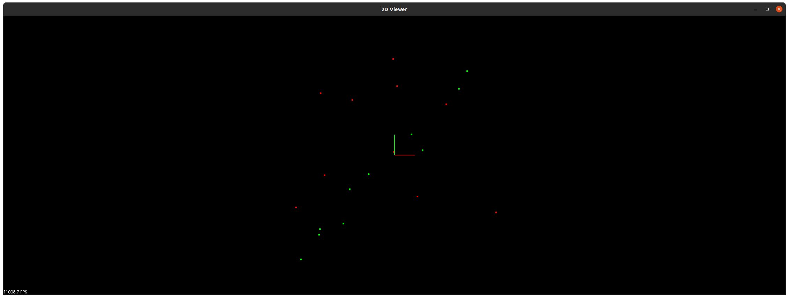
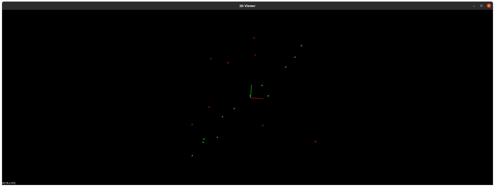
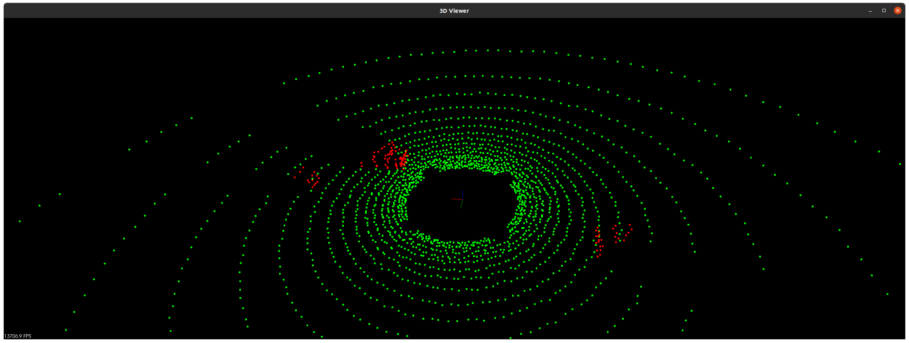
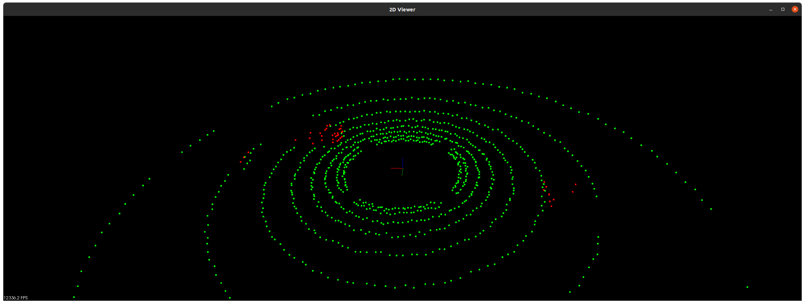

# RANSAC Quiz

## my result

- max iteration : 10
- distance tolerance : 1.0

## solution

- max iteration : 10
- distance tolerance : 1.0

## plane segmentation with PCL

- max iteration : 100
- distance tolerance : 0.2

- time(t) : 0 ms

## point 2 plane from scratch

- max iteration : 100
- distance tolerance : 0.2

- time(t) : 12-13 ms

